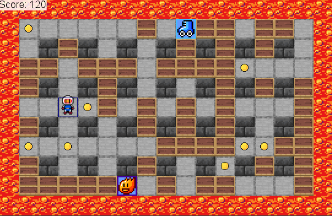

# Real-time game agent using Monte Carlo tree search

Software engineering course work at Vilnius Univesity.

Development and analysis of a real-time game agent using Monte Carlo Tree Search (MCTS) for a Bomberman-inspired game. The agent demonstrates limited success, excelling at bomb avoidance but struggling with forward progression due to conservative decision-making influenced by the reward system.

Read the paper [here](./paper.pdf)

The tree visualizer can also be accessed [here](https://benasb.github.io/vu-kursinis). Example data file can be found [here](./visualizer/testdata.json).

